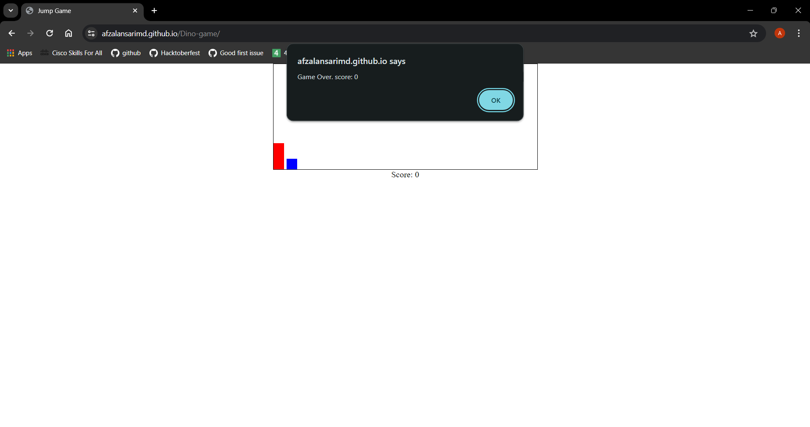
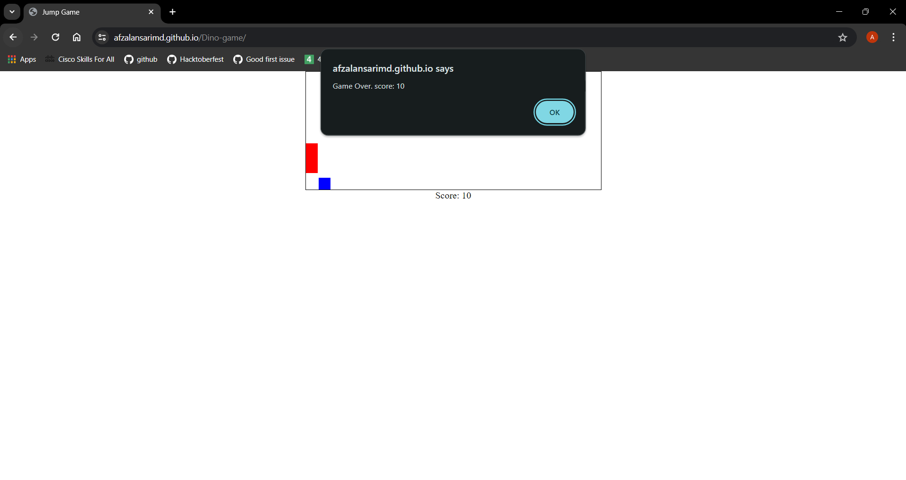

<div id="top"></div>

# Dino Game

<details>
<summary>Table of contents</summary>

-   [Overview](#overview)
-   [Technology Stack](#technology-stack)
-   [Getting Started](#getting-started)
-   [Features](#features)
-   [Screenshots](#screenshots)
-   [Link](#link)

</details>

## Overview
•Designed and developed an offline dinosaur game using HTML, CSS, and JavaScript, providing an engaging
user experience when internet connectivity is lost.<br>
•Implemented features such as obstacle detection, score tracking, and responsive design, demonstrating
proficiency in front-end web development

## Technology Stack


- HTML
- CSS
- JS


## Getting Started

1. Clone the repository:

   ```bash
   https://github.com/AfzalAnsariMd/Dino-game.git
   cd Dino-game

   ```


## Features

**Offline Game**:Designed and developed an offline dinosaur game.
**Score Tracking**:When we pass an obstacle, the score will increase.

## Screenshots

<table>
    <tr>
        <th>Desktop View</th>
    </tr>
    <tr>
      <td colspan="3" style="text-align: left; font-weight: bold;">Home</td>
    </tr>
    <tr>
        <td>
            
        </td>
    </tr>
    <tr>
      <td colspan="3" style="text-align: left; font-weight: bold;">Playing the game</td>
    </tr>
    <tr>
        <td>
            
        </td>
    </tr>
    <tr>
      <td colspan="3" style="text-align: left; font-weight: bold;">Game Over</td>
    </tr>
    <tr>
        <td>
            
        </td>
    </tr>
    <tr>
      <td colspan="3" style="text-align: left; font-weight: bold;"></td>
    </tr>
    <tr>
      <td colspan="3" style="text-align: left; font-weight: bold;"></td>
    </tr>
</table>

## Link
[🚀 Live Page](https://afzalansarimd.github.io/Dino-game/)

<p align="right"><a href="#top">⬆️ Back to Top</a></p>
